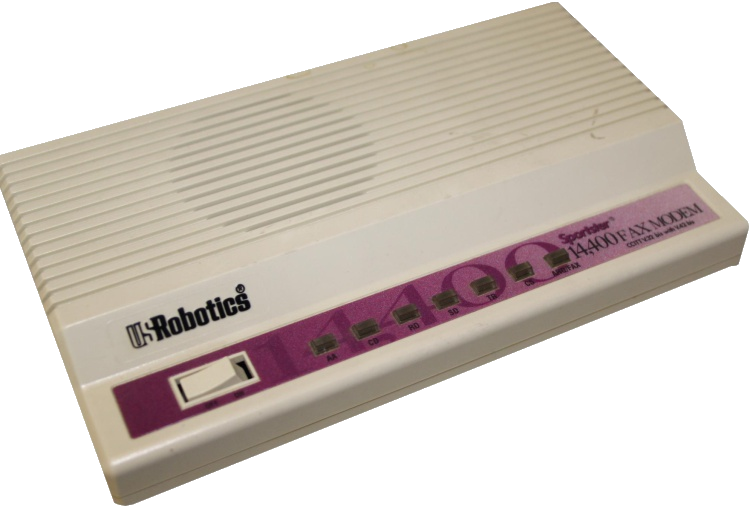

# US Robotics Sportster 14,400

[](https://monomyth.github.io/usr-modem/)

**[Open the live simulator](https://monomyth.github.io/usr-modem/)** and click **Connect at 14,400 bps**. The lamps and the handshake play in the browser. **Disconnect** hangs up.

A 20-second recording of one call, picture and sound: [demoreel.mp4](demoreel.mp4).

A browser simulator of a U.S. Robotics Sportster 14,400 fax modem placing a 14,400 bps call. The front panel is a photograph of the modem. The AA, CD, RD, SD, TR, and ARQ lamps sit on the real indicator wells and follow the handshake. Audio is a V.32bis-style train: dial tone, touch tones, ringback, answer tone, training, then a data carrier. The terminal logs a typical mail and web session while the call is up.

Plain HTML, CSS, and JavaScript. No build step. The site above is this repository served by GitHub Pages.

## Run locally

Opening `index.html` as a file can keep the browser from starting audio. Serve the folder over HTTP:

```bash
python3 -m http.server 8080
```

Then open http://127.0.0.1:8080/.

## Tests

```bash
npm test
npm run test:playwright
```

`npm test` checks the call phases, lamp map, and handshake audio. It needs Node. The Playwright script drives the page in a browser and needs `npm install` first.

## License

[MIT](LICENSE)
